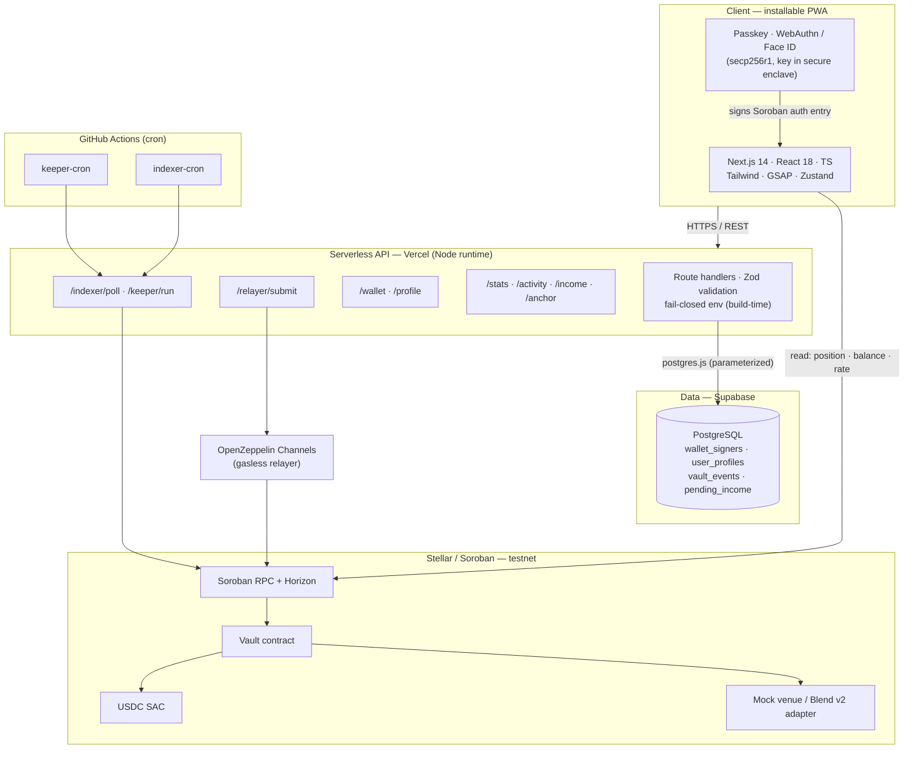
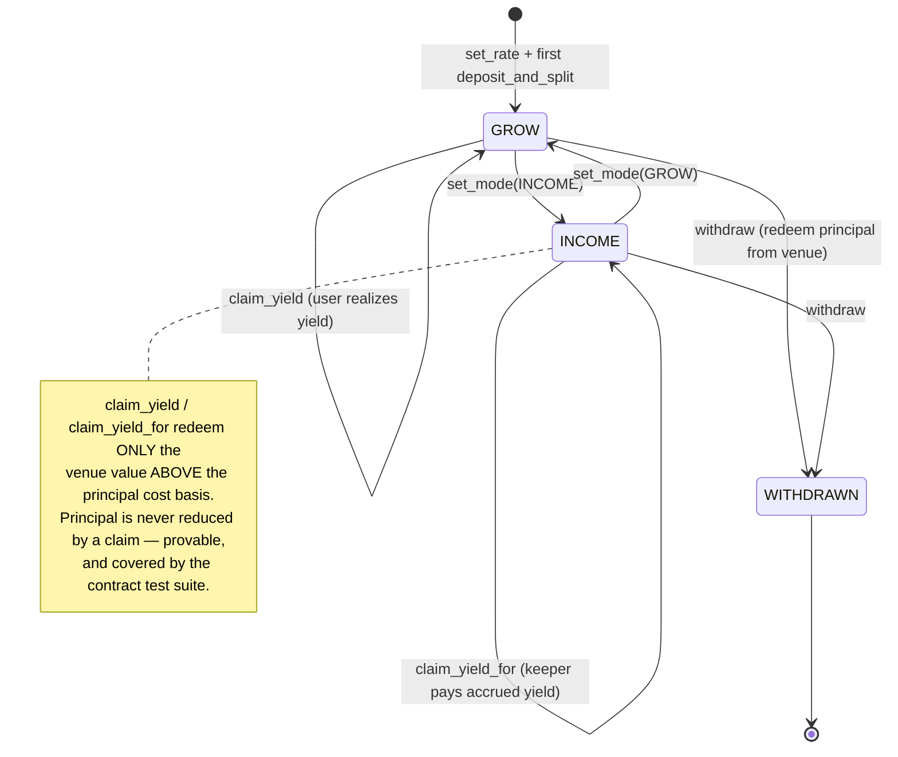
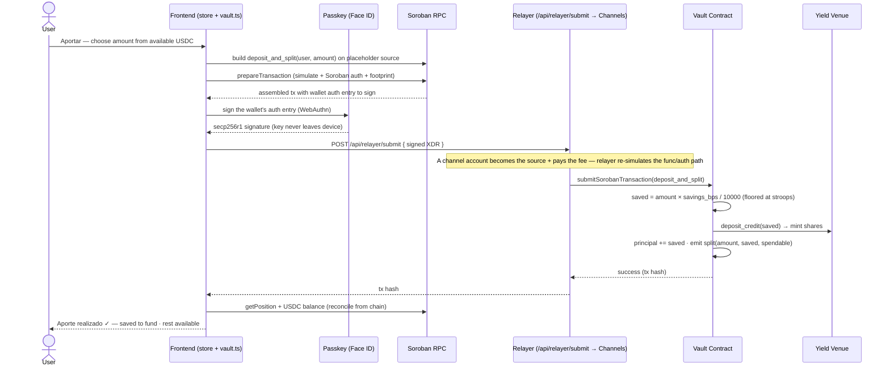
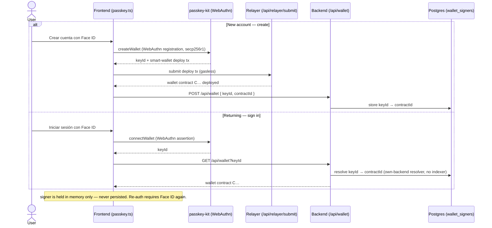
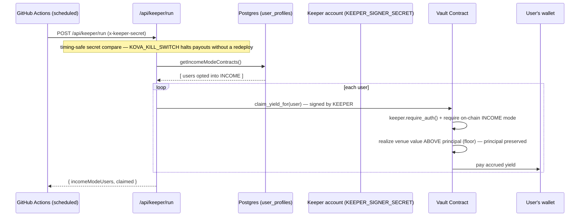

<div align="center">

# Kova

**Automatic Dollar Savings on Stellar**

Auto-save a slice of every payment you receive into a non-custodial, yield-bearing dollar vault — sign in with Face ID, no bank, no seed phrase, no gas.

[](https://stellar.org)
[](https://soroban.stellar.org)
[](https://nextjs.org/)
[](https://www.typescriptlang.org/)
[](https://passkeys.dev)

[Live Demo](https://kova-app-fawn.vercel.app) · [How It Works](#how-it-works) · [Quick Start](#quick-start) · [API](#api-endpoints) · [Security Model](#security-model)

---

</div>

## Table of Contents

- [Overview](#overview)
- [Core Features](#core-features)
- [Architecture](#architecture)
- [How It Works](#how-it-works)
  - [Position Lifecycle](#position-lifecycle)
  - [Deposit & Auto-Split Flow](#deposit--auto-split-flow)
  - [Passkey Authentication Flow](#passkey-authentication-flow)
  - [Income Keeper Flow](#income-keeper-flow)
- [Quick Start](#quick-start)
- [Project Structure](#project-structure)
- [API Endpoints](#api-endpoints)
- [Environment Variables](#environment-variables)
- [Technology Stack](#technology-stack)
- [Security Model](#security-model)
- [Deployment](#deployment)

---

## Overview

**Kova** is a non-custodial dollar-savings wallet built on Stellar/Soroban for the gig economy and the unbanked of LATAM. The user sets a savings percentage; when money arrives, a Soroban **vault** keeps that slice in a dollar-denominated, yield-bearing position the instant it lands and leaves the rest spendable. The vault has two phases — **GROW** (accumulate) and **INCOME** (live off the yield, principal preserved). People onboard with **Face ID** (a passkey smart wallet) and pay **zero gas** thanks to a gasless relayer.

### The Problem

For freelancers, gig workers, and the unbanked, saving for the future is structurally hard:

- **Variable income** — "save what's left" rarely leaves anything left.
- **No formal employment** — no employer pension, no clear retirement path.
- **Local-currency inflation** — savings in the local currency quietly lose value.
- **Custodial risk** — traditional apps can freeze, hold, or lend out the money.

**Kova solves this** by *paying yourself first* on-chain: a fixed percentage of each payment is swept into a USD-denominated vault automatically, it earns real yield, and it stays the user's — provably, on Stellar's ledger, with no custodian.

### Why Stellar

1. **Works unbanked** — a Stellar wallet + a local cash agent is the only on/off-ramp needed.
2. **Dollar-denominated** — USDC savings hold value against local inflation.
3. **Non-custodial** — nobody can freeze or lend the money; it's auditable on-chain in real time.
4. **Remittance-native** — money from abroad is saved the instant it arrives.

> **Status:** testnet-only hackathon build. The app, contracts, and service layer are real and run end-to-end on Stellar **testnet**; mainnet is gated behind an external audit and a regulated cash-in/out anchor.

---

## Core Features

### Pay-Yourself-First Auto-Split
The vault's `deposit_and_split` keeps the user's chosen percentage in the fund and leaves the remainder spendable — atomically, in one signed transaction. Principal is only ever increased by a deposit, never silently moved.

### Face ID Smart Wallets (Passkeys)
Accounts are **secp256r1 passkey smart wallets** (WebAuthn / Face ID) created with [passkey-kit](https://github.com/kalepail/passkey-kit). The private key never leaves the device's secure enclave — no seed phrase to lose, no password to phish.

### Gasless by Default
Every state-changing transaction is submitted through an **OpenZeppelin Channels** relayer: a channel account becomes the source and pays the fee, so the user holds zero XLM and never sees gas.

### GROW / INCOME Modes
`set_mode` toggles a position between **GROW** (accumulate principal + yield) and **INCOME** (a keeper pays out accrued yield on a schedule — "live off your savings"). Switching modes never touches principal.

### Real Yield, Principal-Preserving
Savings are deployed into a yield **venue** (a share/NAV model). `claimable_yield` is computed as *current share value − principal cost basis*; `claim_yield` redeems **only** the value above principal. Principal-preservation is provable and covered by the contract test suite.

### Autonomous Income Keeper
A designated **keeper** can call `claim_yield_for(user)` to pay a user their own accrued yield without the user's device — gated on-chain by `keeper.require_auth()` **and** the position actually being in INCOME mode. The keeper has no custody: it can only realize a user's own yield *to that user*, and never reduces principal.

### Income Watcher
A backend indexer streams the USDC SAC `transfer` events, detects incoming payments to registered wallets, and surfaces a one-tap **"route this income"** card on the home screen (non-custodial — the user signs the routing).

### Cash In / Out (SEP-24)
A SEP-1 → SEP-10 → SEP-24 flow (proxied server-side to stay anchor-agnostic and CORS-free) lets users move between local cash and USDC via a Stellar anchor.

### Live Projection & Gamification
GSAP-animated projection charts, savings streaks, and levels — all derived from **real chain-indexed events**, not local counters.

---

## Architecture



**Trust Boundaries**

| Boundary | Trust Level | Verification |
|---|---|---|
| Browser → API | Untrusted | Money never moves on an API call alone; every value transfer needs a **passkey-signed Soroban auth entry**. |
| Passkey → Smart wallet | Device-held | The smart-wallet contract verifies the **secp256r1 signature on-chain**; the key never leaves the enclave. |
| API → Relayer → Chain | Fee-paying, not authorizing | The relayer sets the tx **source + fee** but cannot alter the signed auth entry or the funds it moves. |
| API → Database | Internal cache | `postgres.js` parameterized queries; the DB is an **index/cache** — chain is the source of truth. |
| Keeper → Vault | No custody | `keeper.require_auth()` + on-chain INCOME-mode check; `claim_yield_for` **always pays the user** and never reduces principal. |

---

## How It Works

### Position Lifecycle



---

### Deposit & Auto-Split Flow



---

### Passkey Authentication Flow



---

### Income Keeper Flow



---

## Quick Start

Hackathon project — ready for demos and testnet deployments; mainnet hardening is in progress.

**Prerequisites**

- **Node.js** 18+ ([nodejs.org](https://nodejs.org/))
- A **PostgreSQL** database (e.g. [Supabase](https://supabase.com) free tier)
- An **OpenZeppelin Channels** testnet API key ([channels.openzeppelin.com](https://channels.openzeppelin.com/testnet/gen)) — for gasless submission
- **Stellar CLI** ([developers.stellar.org](https://developers.stellar.org)) — only to deploy/redeploy the contracts
- A browser with **passkey** support (Face ID / Touch ID / Windows Hello). WebAuthn needs a secure context — `localhost` or HTTPS.

### Run locally

```bash
git clone <repo-url> kova-app
cd kova-app

npm install
cp .env.example .env.local        # testnet NEXT_PUBLIC_* defaults already filled

# Fill in the server-only blanks in .env.local:
#   DATABASE_URL   (Supabase transaction pooler, port 6543)
#   DIRECT_URL     (Supabase direct connection, port 5432 — for migrations)
#   RELAYER_JWT    (OpenZeppelin Channels testnet key)

npm run db:migrate                # apply the schema (wallet_signers, profiles, …)
npm run dev                       # http://localhost:3000
```

### Deploy / redeploy the contracts (optional)

```bash
# Generates + funds a deployer, builds the wasm, deploys the mock venue + vault,
# initializes them, and (if KEEPER is set) designates the keeper. Prints the contract ids.
TOKEN=<USDC_SAC> npm run deploy:testnet
```

Then set `NEXT_PUBLIC_VAULT_CONTRACT_ID` / `NEXT_PUBLIC_VENUE_CONTRACT_ID` to the printed ids.

### Verify the build

```bash
npm run typecheck                     # tsc --noEmit
npm run lint                          # next lint
npm test                              # vitest (yield math)
npm run build                         # fail-closed: errors if a required env var is missing
cd contracts/vault && cargo test      # vault contract tests (19 across all three crates)
```

---

## Project Structure

```
kova-app/
├── app/
│   ├── page.tsx                       # Marketing landing (GSAP, pension-first story)
│   ├── auth/page.tsx                  # Face ID create / sign-in
│   ├── onboarding/page.tsx            # First-run: name, savings %, mode
│   ├── (app)/                         # Authenticated shell + bottom nav
│   │   ├── home/page.tsx              # Balance, pending income, streak, projection
│   │   ├── deposit/page.tsx           # Manual contribution from available USDC
│   │   ├── receive/  send/            # Address + QR · USDC SAC transfer
│   │   ├── vault/  income/            # Fund detail + withdraw · claim yield
│   │   ├── cash/page.tsx              # SEP-24 cash in / out
│   │   └── projection/ goals/ streak/ activity/ settings/
│   └── api/                           # Serverless route handlers (Node runtime)
│       ├── wallet/route.ts            # passkey keyId → wallet contract resolver
│       ├── relayer/submit/route.ts    # gasless Soroban submit (OZ Channels)
│       ├── profile/route.ts           # preferences cache (non-authoritative)
│       ├── activity/ stats/ income/pending/ anchor/
│       ├── indexer/poll/route.ts      # event indexer (secret-guarded)
│       └── keeper/{run,pubkey}/route.ts
├── components/
│   ├── kova.tsx                       # Icons, charts, hooks, Logo / LogoMark
│   └── BottomNav.tsx  ActionSheet.tsx
├── lib/
│   ├── store.ts                       # Zustand store (chain-reconciled, partialized)
│   ├── env.ts                         # fail-closed env validation (Zod)
│   ├── stellar/                       # client · vault · passkey · keeper · send · balance · rate · relayerSubmit · config
│   ├── indexer/                       # income watcher + vault-event indexer + repos + decode
│   ├── anchor/  profile/  stats/  income/  wallet/  db/
│   └── yield.ts  yield.test.ts        # projection math + tests
├── contracts/
│   ├── vault/                         # kova-vault: deposit_and_split, claim_yield_for, withdraw …
│   ├── mock_venue/                    # TEST-ONLY yield venue (shares + NAV)
│   └── blend_adapter/                 # Blend v2 lending-pool adapter (mainnet path)
├── scripts/                           # check-env · db-migrate · deploy-testnet · indexer · e2e-testnet
├── .github/workflows/                 # ci · keeper-cron · indexer-cron
└── lib/db/schema.sql                  # wallet_signers · user_profiles · vault_events · pending_income · indexer_cursor
```

---

## API Endpoints

All routes are under `/api` and run on the Node.js serverless runtime. State-changing money flows are authorized by the **passkey-signed Soroban transaction itself**, not by an API session — so most routes are thin read/cache layers. Job routes are guarded by a shared secret.

### Wallet & Profile

| Method | Path | Description | Guard |
|---|---|---|---|
| `POST` | `/wallet` | Register a passkey `keyId → wallet contractId` mapping | — |
| `GET` | `/wallet` | Resolve a passkey `keyId` to its wallet `contractId` (own-backend resolver) | — |
| `GET` | `/profile` | Read a profile / preferences (defaults if none) | — |
| `POST` | `/profile` | Upsert preferences cache *(non-authoritative — chain is source of truth)* | — |

### Money & Chain

| Method | Path | Description | Guard |
|---|---|---|---|
| `POST` | `/relayer/submit` | Submit a passkey/deploy Soroban tx **gaslessly** via OZ Channels | Server key |
| `GET` | `/activity` | Indexed vault events for a wallet (split / claim / withdraw) | — |
| `GET` | `/stats` | Chain-derived stats: saved this week/month + deposit streak | — |
| `GET` | `/income/pending` | Detected incoming USDC awaiting routing for a wallet | — |
| `POST` | `/income/pending` | Mark a pending income `routed` / `dismissed` | — |
| `POST` | `/anchor` | SEP-24 proxy: `info` · `challenge` · `verify` · `interactive` · `transaction` | — |

### Jobs (secret-guarded)

| Method | Path | Description | Guard |
|---|---|---|---|
| `POST` | `/indexer/poll` | Index vault events + scan USDC transfers (income watcher) | `INDEXER_SECRET` |
| `POST` | `/keeper/run` | Trigger INCOME-mode yield payouts via `claim_yield_for` | `x-keeper-secret` |
| `GET` | `/keeper/pubkey` | The keeper's public key (for auto-save signer delegation) | — |

### Vault contract methods (Soroban)

| Method | Description |
|---|---|
| `init(admin, token, venue, yield_bps)` | One-time setup — stores admin / USDC token / venue + the fallback rate |
| `set_rate(user, bps)` | Set the savings percentage (e.g. `1500` = 15%) |
| `deposit_and_split(user, amount)` | Keep `saved %` in the venue, leave the rest spendable |
| `set_mode(user, mode)` | Toggle `GROW` (0) ↔ `INCOME` (1) |
| `claim_yield(user)` | User realizes accrued yield (principal preserved) |
| `claim_yield_for(user)` | **Keeper-only** payout of a user's own yield (INCOME mode) |
| `withdraw(user, amount)` | Redeem principal from the venue (subject to any lock) |
| `position` / `claimable_yield` | Read position / real venue-earned yield |
| `set_keeper` / `keeper` / `set_yield` / `lock` | Admin + position controls |

---

## Environment Variables

`NEXT_PUBLIC_*` values are inlined into the client bundle at build time — **never** put a secret there. The production `build` fails closed if a required var is missing.

### Client (`NEXT_PUBLIC_*`)

| Variable | Description | Default |
|---|---|---|
| `NEXT_PUBLIC_STELLAR_NETWORK` | `testnet` or `mainnet` | `testnet` |
| `NEXT_PUBLIC_RPC_URL` | Soroban RPC URL | testnet RPC |
| `NEXT_PUBLIC_HORIZON_URL` | Horizon API URL | testnet Horizon |
| `NEXT_PUBLIC_NETWORK_PASSPHRASE` | Stellar network passphrase | testnet passphrase |
| `NEXT_PUBLIC_VAULT_CONTRACT_ID` | Deployed vault contract id | Required |
| `NEXT_PUBLIC_USDC_SAC` | USDC Stellar Asset Contract address | Required |
| `NEXT_PUBLIC_VENUE_CONTRACT_ID` | Yield venue the vault routes into | Required |
| `NEXT_PUBLIC_WALLET_WASM_HASH` | Passkey smart-wallet wasm hash (relayer deploys from it) | Required |
| `NEXT_PUBLIC_YIELD_RATE` | Static fallback rate if the live venue read fails | `0.045` |
| `NEXT_PUBLIC_KILL_SWITCH` | `true` disables money actions + shows a banner | `false` |
| `NEXT_PUBLIC_ANCHOR_HOME_DOMAIN` | SEP-24 anchor home domain | `testanchor.stellar.org` |
| `NEXT_PUBLIC_ANCHOR_ASSET_CODE` | SEP-24 asset code | `SRT` |

### Server-only secrets

| Variable | Description |
|---|---|
| `RELAYER_URL` / `RELAYER_JWT` | OpenZeppelin Channels relayer endpoint + API key (gasless submission) |
| `DATABASE_URL` | PostgreSQL connection (transaction pooler, port 6543) — used at runtime |
| `DIRECT_URL` | Direct connection (port 5432) — used only for migrations / DDL |
| `INDEXER_SECRET` | Shared secret guarding `POST /api/indexer/poll` |
| `KEEPER_SECRET` | Shared secret guarding `POST /api/keeper/run` |
| `KEEPER_SIGNER_SECRET` | The vault's designated keeper account secret (`S…`) |
| `KEEPER_MIN_CLAIM_USD` | Dust guard — skip payouts below this (default `0.01`) |
| `KOVA_KILL_SWITCH` | `true` halts keeper payouts at runtime (independent of the client switch) |

---

## Technology Stack

### Frontend

| Layer | Technology |
|---|---|
| Framework | Next.js 14 (App Router), React 18, TypeScript |
| Styling | TailwindCSS + a CSS-class design system ("Volt Dark") |
| Animation | GSAP (`@gsap/react`) |
| State | Zustand (persisted, chain-reconciled) |
| Fonts | Space Grotesk + JetBrains Mono (self-hosted, CSP-safe) |

### Backend / API

| Layer | Technology |
|---|---|
| Runtime | Next.js serverless route handlers (Node.js), Vercel |
| Database | PostgreSQL (Supabase) via `postgres.js` |
| Validation | Zod on request bodies; fail-closed env validation at build |
| Jobs | GitHub Actions cron (keeper + indexer) |

### Smart Contracts

| Layer | Technology |
|---|---|
| Language | Rust · `soroban-sdk` 22 (`wasm32v1-none`) |
| Contracts | `vault` · `mock_venue` (test) · `blend_adapter` (Blend v2, mainnet path) |
| Tests | 19 `cargo test` cases across the three crates |

### Blockchain & Wallets

| Layer | Technology |
|---|---|
| Network | Stellar / Soroban (testnet) |
| SDK | `@stellar/stellar-sdk` 14 (RPC + Horizon) |
| Wallets | `passkey-kit` 0.12 — secp256r1 passkey smart wallets (WebAuthn) |
| Gasless relayer | OpenZeppelin "Channels" (`@openzeppelin/relayer-plugin-channels`) |
| Standards | SEP-1 / SEP-10 / SEP-24 (cash in/out), SAC `transfer` (USDC) |

---

## Security Model

Kova is **non-custodial by construction**: no server, relayer, or keeper can move a user's principal. Security findings have been driven by repeated adversarial multi-agent reviews; the runbook lives in [`SECURITY.md`](./SECURITY.md).

### Key Security Properties

| Property | Implementation |
|---|---|
| **Non-custodial** | Passkey private keys never leave the device enclave. Every transfer is authorized by an on-chain `secp256r1` signature. |
| **Principal-preservation** | `claim_yield` / `claim_yield_for` redeem only venue value **above** the principal cost basis; principal is never reduced by a claim. |
| **Keeper has no custody** | `claim_yield_for` requires `keeper.require_auth()` **and** on-chain INCOME mode, and always pays the user — a compromised keeper can at most realize a user's own yield *to that user*. |
| **Gasless ≠ trusted** | The relayer sets the tx source + fee but cannot alter the passkey-signed auth entry; it pays gas, it doesn't authorize value. |
| **On-chain consent** | INCOME-mode payout consent is the user's own `set_mode(INCOME)` on-chain — a poisoned off-chain target list cannot force a GROW-mode user's payout. |
| **Bounded amounts** | The deposit amount is bounded by the wallet's real on-chain balance; displayed figures use stroop-exact math matching the contract. |
| **Non-authoritative cache** | `/api/profile` is a preferences cache only; `mode` / `savings_bps` are enforced on-chain. |
| **Fail-closed config** | `npm run build` throws if a required env var is missing; no silent demo/mock fallback. |
| **Kill switches** | A client switch disables money actions + banners; an independent server `KOVA_KILL_SWITCH` halts keeper payouts without a redeploy. |
| **Hardened HTTP** | CSP, HSTS, and a WebAuthn `Permissions-Policy` are set in `next.config.mjs`. |

### Attack Resistance

| Attack Vector | Status | Mechanism |
|---|---|---|
| Custodial seizure / freeze | ✅ Mitigated | No custodian; funds move only with the device passkey signature |
| Keeper compromise | ✅ Mitigated | `claim_yield_for` only pays a user their own yield; never touches principal |
| Forged off-chain mode | ✅ Mitigated | Keeper re-checks **on-chain** INCOME mode before any payout |
| Malicious SEP-24 anchor | ✅ Mitigated | `WebAuth.readChallengeTx` validates the anchor's challenge (sig + structure) before signing |
| Income-route IDOR | ✅ Mitigated | `POST /api/income/pending` scoped by `event_id` + `contract_id` + `status` |
| Fake-success on unconfirmed tx | ◐ Partial | The keypair/keeper path blocks on an observed on-chain `SUCCESS`; the gasless passkey path reports on the relayer's submit ack, then reconciles position + balance from chain |
| Balance clobber on RPC blip | ✅ Mitigated | Balance reads return `null` on failure → last-known value is kept |
| Keeper-route secret timing leak | ✅ Mitigated | Constant-time (`timingSafeEqual`) secret comparison |
| Double-submit / double-spend | ✅ Mitigated | Synchronous in-flight guard client-side; idempotent claims on-chain |
| Gas griefing | ✅ Mitigated | Gasless relayer — the user holds no XLM and pays no fee |

---

## Deployment

Kova runs entirely on free tiers — see [`DEPLOY.md`](./DEPLOY.md) for the full walkthrough.

### Frontend + API → Vercel

```bash
# Set all NEXT_PUBLIC_* + server-only secrets in the Vercel dashboard, then:
vercel --prod
# next.config.mjs configures CSP, HSTS, and the WebAuthn Permissions-Policy
```

### Database → Supabase (or any Postgres)

```bash
# Apply the schema using the DIRECT (session) connection:
DIRECT_URL="postgresql://…:5432/…" npm run db:migrate
```

### Contracts → Stellar testnet

```bash
TOKEN=<USDC_SAC> npm run deploy:testnet
# prints the vault + venue contract ids → set them as NEXT_PUBLIC_* and redeploy the web app
```

### Scheduled jobs → GitHub Actions

`.github/workflows/keeper-cron.yml` and `indexer-cron.yml` POST to `/api/keeper/run` and `/api/indexer/poll` on a schedule. Add the repo secrets `KOVA_APP_URL`, `KEEPER_SECRET`, and `INDEXER_SECRET`.

### Deployed (Testnet)

| Resource | Value |
|---|---|
| Live app | https://kova-app-fawn.vercel.app |
| Vault | `CDHH3UOCF7NQNVXLOCZTD4GOYB5W4RREDCRCT7364YYTYUXQACEUUHCJ` |
| Yield venue | `CAIRVI55VB7V2ABDICDFP6LNZMFFWFH3CKZ3WFCZEAUMOHZWHVIMVUF4` |
| USDC SAC | `CBIELTK6YBZJU5UP2WWQEUCYKLPU6AUNZ2BQ4WWFEIE3USCIHMXQDAMA` |

---

<div align="center">

**Pay yourself first · Non-custodial · Settled on Stellar**

</div>
